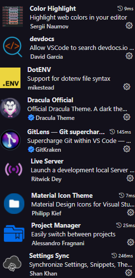
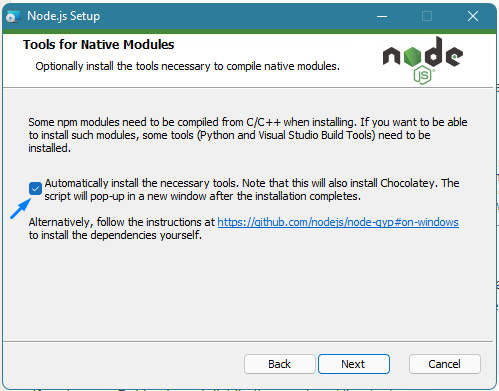

# starter-pack

### This is a repository to guide you in your first configuration of your development machine (Windows-based)

## Step 1: Installing GIT

- Git [download](https://git-scm.com/downloads) page 
- You can look at the step-by-step on [Git](https://git-scm.com/book/en/v2/Getting-Started-Installing-Git) on other systems

## Step 2: Creating a GitHub account

- You can follow the [GitHub](https://github.com/join) step-by-step 

## Step 3: Using the GitHub Desktop application

- Download and tutorial link [here](https://desktop.github.com/)

## Step 4: Installing VS Code

- Download the **System Installer** [here](https://code.visualstudio.com/download) and install on your machine 

### Step 4.1: Installing VS Code Extensions

- The following extensions are the most commom in the community.
* Color Highlight
* devdocs
* DotENV
* Dracula Official
* GitLens
* Live Server
* Material Icon Theme
* Project Manager
* Settings Sync
** With **Settings Sync**, you can upload your VS Code configuration to GitHub and download it in any computer.
** It automatically installs any extension and apply your configurations previously saved.

## Step 5: Installing Fira Code fonts

- You can download the fira code family [here](https://fonts.google.com/specimen/Fira+Code). Just install it all 

## Step 6: Installing NodeJS

- You can download it [here](https://nodejs.org/pt-br/download/)
*Aways use **LTS** version* 
- In installation, allow the install of necessary packages.

## Step 7: Installing [Insomnia](https://insomnia.rest)

